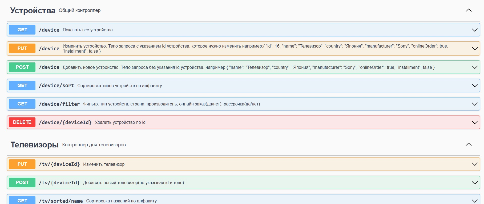
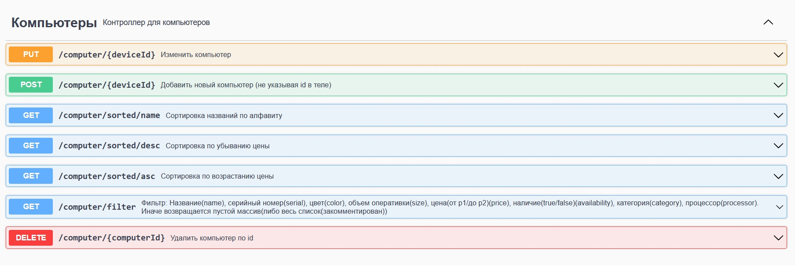
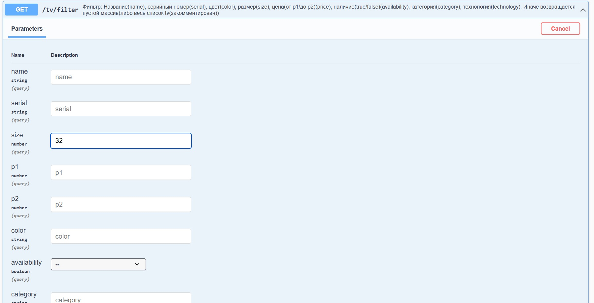
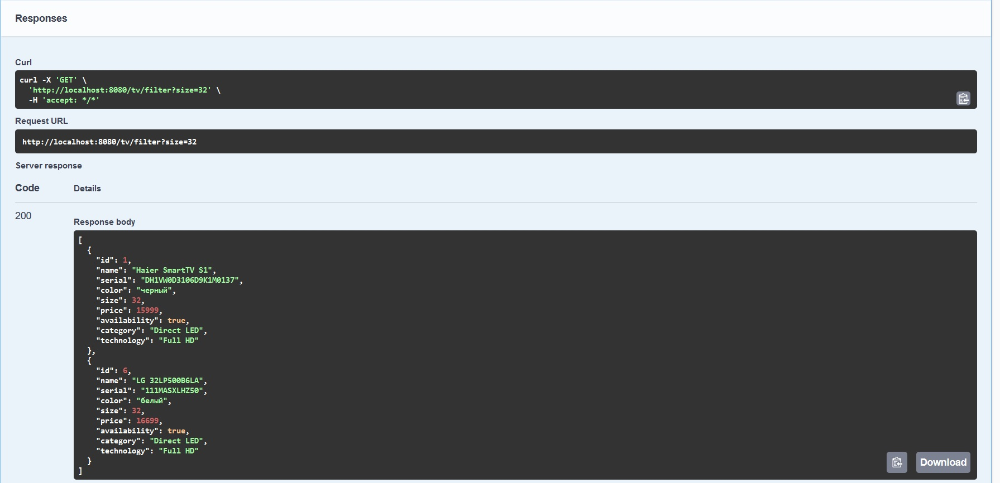

## Реестр бытовой техники(REST).

### Описание:
REST-приложение с Open API v3 документацией в виде страницы swagger.
Реализован реестр техники (телевизоры, пылесосы, холодильники, смартфоны и ПК) с привязкой к ним моделей с собственными характеристиками. 

#### По заданию:
1.	Реализована фильтрация по всем параметрам техники в общем, так и каждого вида в отдельности.
2.	Реализовать сортировку по алфавиту и по стоимости. Реализовано для каждого вида техники.
3.	Реализовать возможность добавлять новые позиции и модели к ним, в зависимости от выбранного вида техники.
    Для полноты картины(CRUD), добавил возможность как обновить и удалить целый вид техники, так и отдельный экземпляр.
    
  В этом варианте приложения dto слой не использовался. 

#### Стек:
-	Язык программирования: **Java 8**;
-   Сборка: **Maven 3.9.2** 
-	Frameworks: **Spring Boot 2.7.12, Spring Web, Spring Data JPA, Spring Validation, Spring Boot DevTools**;
-	База данных: **Postgres SQL 14**;
-   Миграция: **liquibase**;
-   Для сокращения кода: **Lombok**;
-	Библиотека для генерации документации: **springdoc-openapi v1.5.9**;

-   Для тестирования и взаимодействия использовался **Postman** и http://localhost:8080/swagger-ui.html

#### Для запуска:

Java 8, Maven 3+, PostgreSql 14, swagger-ui/Postman

<br>

#### Запуск через IDE:
- Создать базу данных device_db (pgAdmin4)

- В IDE:
````
Run class DeviceListApplication
````

#### Запуск из командной строки:
- Создать базу данных device_db (pgAdmin4)

- Старт из папки проекта командой:

````
mvn spring-boot:run 
````

#### Выполнение запросов:

http://localhost:8080/swagger-ui.html

Либо в Postman
````
http://localhost:8080
````

#### Демонстрация.
<br>

##### Общий вид для устройств в Swagger-ui


<br>

##### Сервис на примере компьютеров (остальные по аналогии).


<br>

##### Пример работы фильтрации

